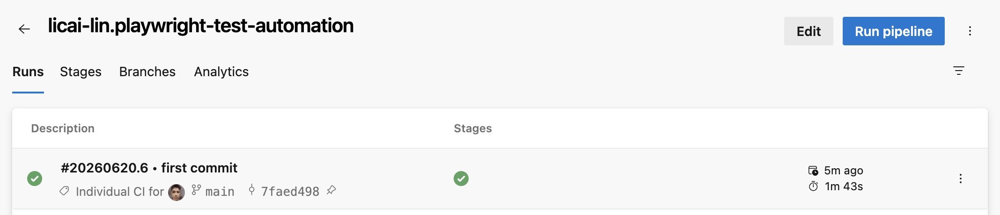

# Playwright Test Automation

This repository is a Playwright + TypeScript test automation project for end-to-end browser testing, API testing, environment configuration, and CI execution with Azure DevOps and Azure Playwright Workspaces.

## Azure DevOps Pipeline

<p align="center">
  
</p>

## What This Project Demonstrates

- End-to-end browser testing with Playwright
- Cross-browser execution with Chromium, Firefox, and WebKit
- API testing using Playwright's `request` fixture
- Environment variable handling for local and CI runs
- HTML report generation
- Azure Playwright Workspaces integration for cloud browser execution
- Azure DevOps pipeline integration from a GitHub repository
- Microsoft Entra ID authentication through an Azure Resource Manager service connection
- CI pipeline triggers for pushes and pull requests on `main`

## Tech Stack

- Playwright
- TypeScript
- Node.js
- Azure Playwright Workspaces
- Azure DevOps Pipelines
- GitHub

## Project Structure

```text
.
├── tests/
│   ├── example.spec.ts
│   ├── login.spec.ts
│   ├── env.spec.ts
│   └── json-placeholder-api.spec.ts
├── docs/
│   ├── azure-pipelines-sample.md
│   ├── local-playwright-workspaces.md
│   └── setup-azure-devops-github-pipeline.md
├── playwright.config.ts
├── playwright.service.config.ts
├── azure-pipline.yml
├── package.json
└── tsconfig.json
```

## Test Coverage Examples

### UI Testing

`tests/login.spec.ts` validates a login flow on a practice authentication site:

- navigates to the login page
- fills username and password
- submits the form
- verifies successful navigation
- verifies the logout link is visible

The login test supports environment variables:

```ts
const username = process.env.PLAYWRIGHT_USERNAME ?? "student";
const password = process.env.PLAYWRIGHT_PASSWORD ?? "Password123";
```

### API Testing

`tests/json-placeholder-api.spec.ts` demonstrates API validation with Playwright:

- `GET` request validation
- `POST` request validation
- status code checks
- response body assertions

### Environment Variable Testing

`tests/env.spec.ts` verifies that expected environment values are available during test execution.

This is useful for showing the difference between local `.env` files and CI pipeline variables.

## Install Dependencies

```bash
npm install
```

Or for a clean CI-style install:

```bash
npm ci
```

## Run Tests Locally

Run all tests with the standard Playwright config:

```bash
npx playwright test
```

Run with a specific browser project:

```bash
npx playwright test --project=chromium
```

Open the HTML report:

```bash
npx playwright show-report
```

## Run Tests with Azure Playwright Workspaces

This project includes a service config for cloud browser execution:

```text
playwright.service.config.ts
```

Log in to Azure:

```bash
az login
```

Export the Playwright Workspace browser endpoint:

```bash
export PLAYWRIGHT_SERVICE_URL="wss://eastasia.api.playwright.microsoft.com/playwrightworkspaces/86bb2b02-c971-4550-879b-cb1e214766cc/browsers"
```

Run tests through Azure Playwright Workspaces:

```bash
npx playwright test -c playwright.service.config.ts --workers=1
```

## Azure DevOps CI

The pipeline file is:

```text
azure-pipline.yml
```

It is configured to run on:

- pushes to `main`
- pull requests targeting `main`

The pipeline:

1. installs dependencies with `npm ci`
2. authenticates to Azure using an Azure Resource Manager service connection
3. runs Playwright tests through Azure Playwright Workspaces
4. publishes the Playwright HTML report as a pipeline artifact

Key pipeline variables:

```yml
PLAYWRIGHT_SERVICE_URL: "wss://eastasia.api.playwright.microsoft.com/playwrightworkspaces/86bb2b02-c971-4550-879b-cb1e214766cc/browsers"
PLAYWRIGHT_WORKERS: "1"
PLAYWRIGHT_USERNAME: "student"
PLAYWRIGHT_PASSWORD: "Password123"
```

For real projects, sensitive values should be stored in Azure DevOps pipeline variables or variable groups and marked as secret.

## Documentation

Additional setup guides are available in the `docs` folder:

- [Run Playwright Workspaces tests locally](docs/local-playwright-workspaces.md)
- [Azure DevOps pipeline for Playwright Workspaces](docs/azure-pipelines-sample.md)
- [Set up Azure DevOps pipeline from a GitHub repo](docs/setup-azure-devops-github-pipeline.md)

## Key Concepts Covered

This project includes examples of:

- how Playwright handles browser automation and assertions
- how to structure UI and API tests in the same framework
- how environment variables differ between local development and CI
- why secrets should not be committed to Git
- how CI pipelines trigger from GitHub changes
- how Azure DevOps authenticates to Azure using service connections
- how cloud browser execution can scale test runs
- how Playwright reports help debug failed tests

## Notes

This is a learning and showcase project. Some test targets use public demo sites and APIs, so occasional network or third-party availability issues may affect test stability.
